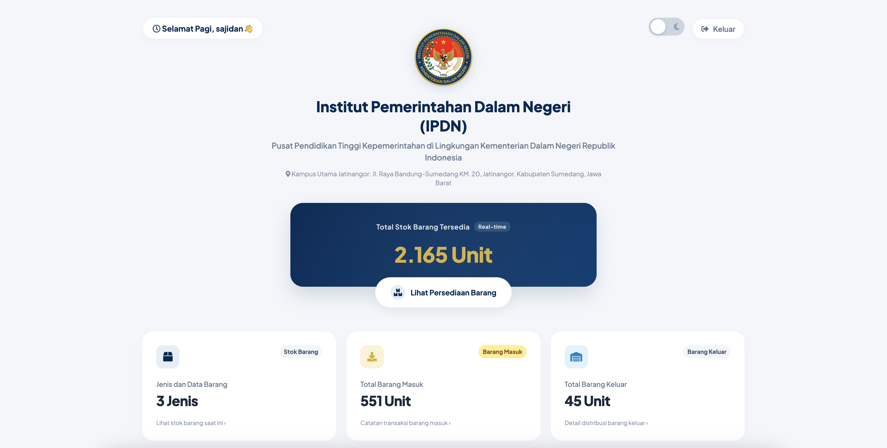
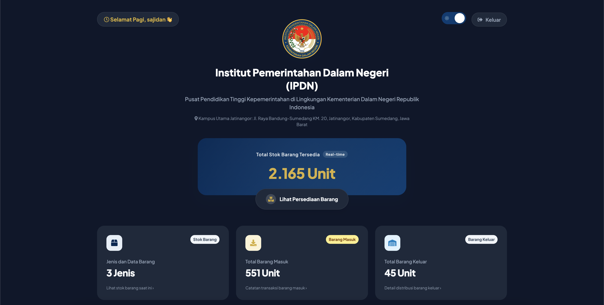
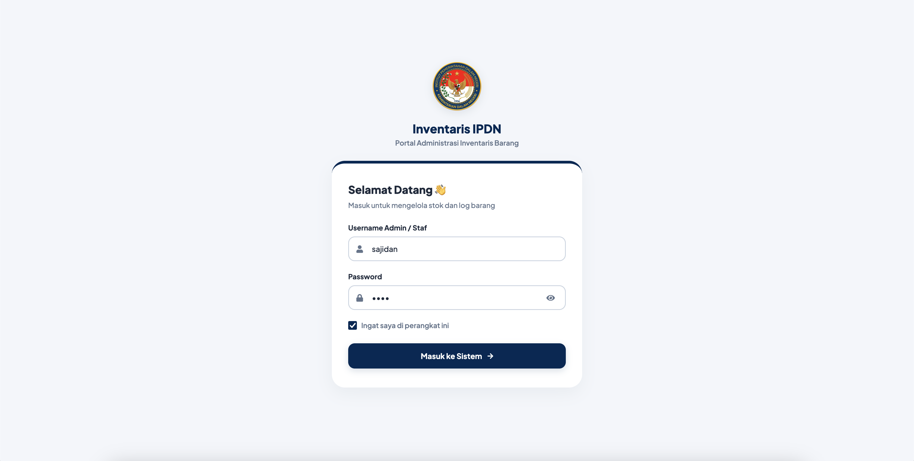
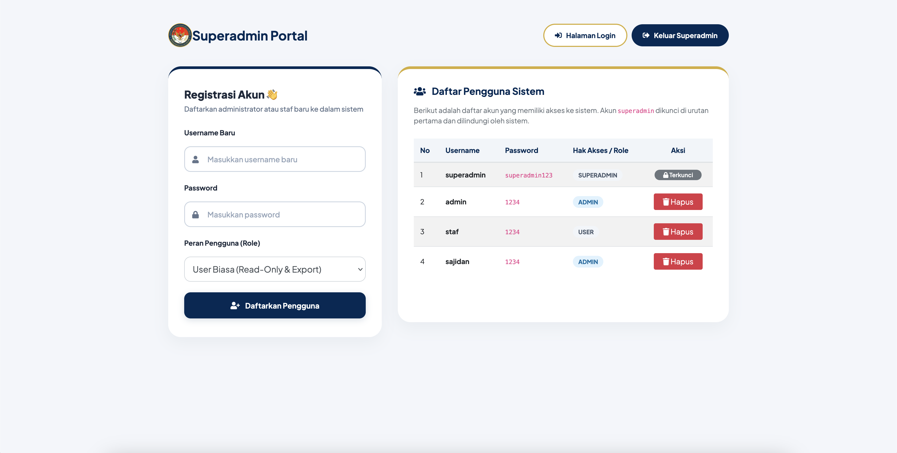

# 🏛️ Sistem Informasi Inventaris Barang - Perpustakaan IPDN

Sistem Informasi Inventaris Barang adalah aplikasi berbasis web (*Single Page Application* / SPA) yang dirancang khusus untuk mengelola persediaan barang, pencatatan log barang masuk, dan distribusi barang keluar di lingkungan **Perpustakaan Institut Pemerintahan Dalam Negeri (IPDN)**. 

Aplikasi ini dibangun menggunakan PHP Native, basis data MySQL, dan dirancang dengan antarmuka modern, responsif, serta tidak kaku, yang sepenuhnya mengadopsi skema warna dan identitas resmi IPDN.

---

## 🚀 Fitur Utama

1. **Arsitektur Single Page Application (SPA)**
   - Semua modul manajemen (Stok Barang, Barang Masuk, Barang Keluar) diintegrasikan ke dalam satu halaman utama (`index.php`).
   - Kartu statistik di bagian atas berfungsi sebagai sakelar (*toggle*) interaktif untuk membuka/menutup tabel manajemen secara dinamis dengan efek transisi halus.
2. **Hak Akses Berbasis Peran (Role-Based Access Control / RBAC)**
   - **Admin**: Akses penuh untuk melihat, mengekspor, menambah, mengubah, dan menghapus data.
   - **User Biasa (Staf)**: Akses terbatas (*read-only*), hanya diizinkan melihat data dan mengekspor laporan. Seluruh tombol aksi modifikasi (tambah, edit, hapus) disembunyikan secara otomatis demi keamanan data.
3. **Gerbang Keamanan Registrasi Superadmin**
   - Rute login khusus untuk `superadmin` yang langsung mengarah ke halaman registrasi akun baru (`register.php`) untuk mendaftarkan staf/admin baru tanpa memasuki dashboard utama.
   - Akun `superadmin` dilindungi secara mutlak (tidak dapat dihapus) dan posisinya dikunci secara otomatis di baris nomor satu pada tabel daftar pengguna.
4. **Keamanan Tambahan (Security Hardening)**
   - Proteksi penuh terhadap celah **SQL Injection (SQLi)** menggunakan *Prepared Statements* (MySQLi) di semua baris kueri SQL.
   - Proteksi terhadap celah **Cross-Site Scripting (XSS)** menggunakan fungsi saring output terpusat.
   - Proteksi ganda di sisi server (*Server-side Request Validation*) untuk mencegah manipulasi data dari luar oleh akun non-admin.
5. **Mode Gelap & Terang (Dark/Light Theme Toggle)**
   - Fitur penggantian tema instan dengan status preferensi yang disimpan secara otomatis di *LocalStorage* browser (pilihan tema tidak akan kembali ke default saat halaman dimuat ulang).
6. **Sapaan Waktu Dinamis**
   - Menampilkan sapaan waktu otomatis (Pagi/Siang/Sore/Malam) berdasarkan jam lokal pada perangkat pengguna, lengkap dengan nama pengguna yang sedang aktif.
7. **Ingat Saya (Remember Me Cookies)**
   - Fitur pengisian otomatis kolom formulir login yang aman menggunakan cookies 30 hari jika dicentang oleh pengguna saat berhasil masuk.
8. **Eksport Laporan Fleksibel**
   - Fitur ekspor data instan ke format **Microsoft Excel (.xls)** dan **PDF (cetak cetak dokumen)** untuk kebutuhan administrasi fisik.

---

## 📸 Snapshots & Desain Antarmuka

Berikut adalah beberapa tampilan utama dari sistem informasi ini:

### 1. Dashboard Utama (Mode Terang)
*Akses dashboard portal yang menampilkan sapaan dinamis, visualisasi total stok, serta tombol kartu navigasi interaktif.*


### 2. Dashboard Utama (Mode Gelap)
*Antarmuka mode gelap yang elegan, dirancang untuk kenyamanan visual dalam penggunaan jangka panjang.*


### 3. Formulir Masuk (Login)
*Desain form masuk modern yang mengadaptasi struktur kartu melayang dengan fitur penutup sandi interaktif dan cookie remember-me.*


### 4. Portal Registrasi Superadmin
*Panel kontrol khusus superadmin untuk mendaftarkan staf/admin baru serta memantau daftar pengguna terdaftar.*


---

## 🛠️ Tech Stack (Teknologi yang Digunakan)

*   **Sisi Server**: PHP Native (v8.2+)
*   **Basis Data**: MySQL (MariaDB)
*   **Sisi Klien**: HTML5, CSS3, JavaScript (Vanilla JS)
*   **Kerangka Kerja CSS**: Bootstrap 4.5.3 (Kustomisasi Premium)
*   **Pustaka Pendukung**: DataTables, FontAwesome 5.15.1, Google Fonts (Plus Jakarta Sans)

---

## 📂 Struktur Direktori Proyek

```text
inventaris-ipdn/
├── assets/
│   └── img/
│       └── logo_ipdn.png        # Logo resmi IPDN
├── css/
│   ├── dashboard.css            # Stylesheet utama dashboard & dark-mode
│   └── login.css                # Stylesheet form login & register
├── js/
│   └── dashboard.js             # Logika interaksi JS, Theme Toggle, & Sapaan
├── cek.php                      # Validasi otentikasi sesi
├── function.php                 # Koneksi database & pemrosesan CRUD sisi server
├── index.php                    # Dashboard portal & Tab-based management (SPA)
├── login.php                    # Form masuk sistem
├── logout.php                   # Penghancur sesi & pengalihan keluar
├── register.php                 # Portal manajemen pengguna khusus superadmin
├── stockbarang.sql              # Skema basis data sistem
├── export_excel.php             # Export excel stok barang
├── export_pdf.php               # Export pdf stok barang
├── exportmasuk_excel.php        # Export excel barang masuk
├── exportmasuk_pdf.php          # Export pdf barang masuk
├── exportkeluar_excel.php       # Export excel barang keluar
└── exportkeluar_pdf.php         # Export pdf barang keluar
